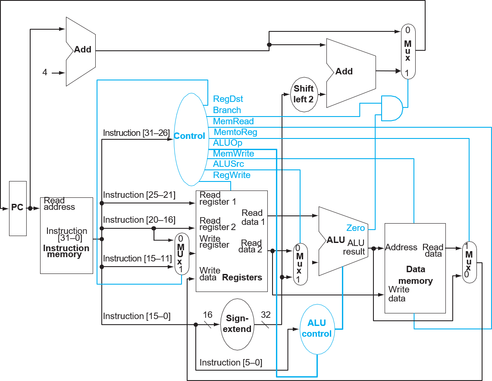

# MIPS 单周期 CPU 设计与实现

## 原理图



我的实现在此图的基础上做了一些小的修改与扩充。

## 模块

### Instrction Memory

代码内存模块。该模块目前使用加载文本文件作为代码的方法实现。

模块定义如下：
```verilog
module im(input  wire        clk,
          input  wire [31:0] addr,
          output wire [31:0] data);
```

### Instruction Register

指令寄存器，用于解码指令，便于将指令中的操作码、寄存器编号、立即数等传输到其他模块使用。

模块定义如下：
```verilog
module ireg(input  wire [31:0] ins,
            output wire [5:0]  opcode,
            output wire [5:0]  funct,
            output wire [4:0]  rs,
            output wire [4:0]  rt,
            output wire [4:0]  rd,
            output wire [4:0]  shamt,
            output wire [15:0] im1,
            output wire [25:0] im2);
```

### Data Memory

数据内存模块。为了支持字节与半字大小的数据读写，加入 `DMOp` 控制信号。

模块定义如下：
```verilog
module dm(input  wire        clk,
          input  wire        dm_w,
          input  wire        dm_r,
          input  wire [31:0] addr,
          input  wire [31:0] wdata,
          input  wire [2:0]  dm_op,
          output wire [31:0] rdata);
```

### Program Counter
程序计数器，用于计算需要执行指令的地址，完成分支跳转等任务。加入 `rt_addr` 作为输入，用于函数调用的语句保存返回地址使用。同时增加 `reg_addr` 作为输入，用于支持 `jr` 等指令。

模块定义如下：
```verilog
module pc(input wire         clk,
          input wire         rest,
          input wire         zero,
          input wire         great,
          input wire  [15:0] im1,
          input wire  [25:0] im2,
          input wire  [3:0]  pc_op,
          input wire  [31:0] j_reg,
          output wire [31:0] rt_addr,
          output wire [31:0] addr);
```

### ALU

ALU 增加了对更多的运算类型的支持。同时加入 `zero`, `great`, `overflow` 等标志信号输出，用于分支跳转。

模块定义如下：
```verilog
module alu(input wire [5:0]  alu_op,
           input wire [31:0] a,
           input wire [31:0] b,
           input wire [4:0]  shamt,
           output reg [31:0] out,
           output wire       zero,
           output wire       great,
           output wire       overflow);
```

### Extend Module

立即数处理模块，完成立即数 sign extend, zero extend, 以及填充高 16 的功能。

模块定义如下：
```verilog
module extend(input  wire [1:0]  ext_op,
              input  wire [15:0] im,
              output wire [31:0] out);
```

### Control
用于生成各种控制信号。

模块定义如下：
```verilog
module control(
           input  wire [5:0] opcode,
           input  wire [5:0] funct,
           input  wire [4:0] hint, // ins[10:6]
           input  wire [4:0] rs,
           input  wire [4:0] rt,
           input  wire [4:0] rd,
           output wire [5:0] alu_op,
           output wire       alu_src, // [rt] or im
           output wire [2:0] dm_op,
           output wire       dm_wr,
           output wire       dm_rd,
           output wire [1:0] ext_op,
           output wire [3:0] pc_op,
           output wire [1:0] reg_src,
           output wire [1:0] reg_dst,
           output wire       reg_wr,
           output wire       reg_in);
```

### Register file
通用寄存器模块。

模块定义如下：
```verilog
module greg(input  wire        clk,
            input  wire        reg_wr,
            input  wire [4:0]  read1,
            input  wire [4:0]  read2,
            input  wire [4:0]  wr_num,
            input  wire [31:0] wr_data,
            output wire [31:0] data1,
            output wire [31:0] data2);
```

## 实现的指令

### I-type

- `lui` (`aui`): `lui` `rs` 字段为 0，`aui` 为其拓展
- `andi`
- `ori`
- `xori`
- `lb`
- `lbu`
- `sb`
- `lh`
- `lhu`
- `sh`
- `lw`
- `sw`
- `addi`
- `addiu`
- `slti`
- `sltiu`
- `bal`
- `beq`: `b`: a special case for `beq`
- `bne`
- `bgez`: 需要參考 rt 字段的值
- `bgezal`
- `bgtz`
- `blez`
- `bltz`

### J-type

- `j`
- `jal`

### R-type

- `and`
- `nor`
- `or`
- `rotr`
- `rotrv`
- `sll`: `nop`
- `sllv`
- `sra`
- `srav`
- `srl`
- `srlv`
- `xor`
- `add`
- `addu`
- `div`
- `mod`
- `divu`
- `modu`
- `mul`
- `muh`
- `mulu `
- `muhu`
- `sub`
- `subu`
- `slt`
- `sltu`
- `jr`
- `jalr`

## 控制信号

- **ALUSrc**: 1 选择 Immediate，0 选择 rt （must be different from RegDst）

- **ExtOp**: SE 表示sign extend，ZE 表示 zero extend，LS 表示 left shift for 16bits

- **ALUOp**:  ALU 运算类型，详见 `common.v` 中的定义

- **PCOp**：NEXT, BZ (branch if `zero`), BNZ (branch if not `zero`), BG (branch if `great`), BNG (branch if not `great` ),  NGNZ (branch if not `zero` and not `great`),  BGZ (branch if `zero` or `great`), J, JA
     
- **DataMemOp**: BS (sign extend byte)，BZ (zero extend byte)，HS，HZ，W，SB，SH

- **RegSrc**: 决定要写入寄存器的数据，可选值：PC (rt_addr), ALU (alu_rs), MEM (dm_data), COP0.

- **RegDst**: RD 选择 rd，RT 选择 rt, 31 选择 31 号寄存器

- **RegIn**: 选择第二个要读的寄存器，在 `bal`, `bgez`, `bgezal`, `bltz` 中使用，使 ALU 的第二个输入为 0 号寄存器。可选 rt， zero。

|          | RegDst | RegWr | ALUSrc | ALUOp | MemWr | MemRd | RegSrc | ExtOp | PCOp  | DMOp | RegIn |
| -------- | ------ | ----- | ------ | ----- | ----- | ----- | ------ | ----- | ----- | ---- | ----- |
| `ins`    | rt     | 1     | 0      | INS   | 0     | 0     | alu    | x     | NEXT  | x    | rt    |
| `ext`    | rt     | 1     | 0      | EXT   | 0     | 0     | alu    | x     | NEXT  | x    | rt    |
| `aui`    | rt     | 1     | 1      | ADD   | 0     | 0     | alu    | LS    | NEXT  | x    | rt    |
| `andi`   | rt     | 1     | 1      | AND   | 0     | 0     | alu    | ZE    | NEXT  | x    | rt    |
| `ori`    | rt     | 1     | 1      | OR    | 0     | 0     | alu    | ZE    | NEXT  | x    | rt    |
| `xori`   | rt     | 1     | 1      | XOR   | 0     | 0     | alu    | ZE    | NEXT  | x    | rt    |
| `addiu`  | rt     | 1     | 1      | ADD   | 0     | 0     | alu    | SE    | NEXT  | x    | rt    |
| `addi`   | rt     | 1     | 1      | ADD   | 0     | 0     | alu    | SE    | NEXT  | x    | rt    |
| `slti`   | rt     | 1     | 1      | SLT   | 0     | 0     | alu    | SE    | NEXT  | x    | rt    |
| `sltiu`  | rt     | 1     | 1      | SLTU  | 0     | 0     | alu    | SE    | NEXT  | x    | rt    |
| `lb`     | rt     | 1     | 1      | ADD   | 0     | 1     | mem    | SE    | NEXT  | BS   | rt    |
| `lbu`    | rt     | 1     | 1      | ADD   | 0     | 1     | mem    | SE    | NEXT  | BZ   | rt    |
| `lh`     | rt     | 1     | 1      | ADD   | 0     | 1     | mem    | SE    | NEXT  | HS   | rt    |
| `lhu`    | rt     | 1     | 1      | ADD   | 0     | 1     | mem    | SE    | NEXT  | HZ   | rt    |
| `lw`     | rt     | 1     | 1      | ADD   | 0     | 1     | mem    | SE    | NEXT  | W    | rt    |
| `sb`     | x      | 0     | 1      | ADD   | 1     | 0     | x      | SE    | NEXT  | SB   | rt    |
| `sh`     | x      | 0     | 1      | ADD   | 1     | 0     | x      | SE    | NEXT  | SH   | rt    |
| `sw`     | x      | 0     | 1      | ADD   | 1     | 0     | x      | SE    | NEXT  | W    | rt    |
| `beq`    | x      | 0     | 0      | SUB   | 0     | 0     | x      | x     | BZ    | x    | rt    |
| `bne`    | x      | 0     | 0      | SUB   | 0     | 0     | x      | x     | BNZ   | x    | rt    |
| `bgtz`   | x      | 0     | 0      | SUB   | 0     | 0     | x      | x     | BG    | x    | rt    |
| `blez`   | x      | 0     | 0      | SUB   | 0     | 0     | x      | x     | BNG   | x    | rt    |
| `bltz`   | x      | 0     | 0      | SUB   | 0     | 0     | x      | x     | BNGNZ | x    | zero  |
| `bgez`   | x      | 0     | 0      | SUB   | 0     | 0     | x      | x     | BGZ   | x    | zero  |
| `bgezal` | 31     | 1     | 0      | SUB   | 0     | 0     | pc     | x     | BGZ   | x    | zero  |
| `bal`    | 31     | 1     | 0      | SUB   | 0     | 0     | pc     | x     | BGZ   | x    | zero  |
| `j`      | x      | 0     | x      | x     | 0     | 0     | x      | x     | J     | x    | rt    |
| `jal`    | 31     | 1     | x      | x     | 0     | 0     | pc     | x     | J     | x    | rt    |
| `jr`     | x      | 0     | x      | x     | 0     | 0     | x      | x     | JR    | x    | rt    |
| `jalr`   | rd     | 1     | x      | x     | 0     | 0     | PC     | x     | JR    | x    | rt    |
| `and`    | rd     | 1     | 0      | AND   | 0     | 0     | alu    | x     | NEXT  | x    | rt    |
| `or`     | rd     | 1     | 0      | OR    | 0     | 0     | alu    | x     | NEXT  | x    | rt    |
| `nor`    | rd     | 1     | 0      | NOR   | 0     | 0     | alu    | x     | NEXT  | x    | rt    |
| `xor`    | rd     | 1     | 0      | XOR   | 0     | 0     | alu    | x     | NEXT  | x    | rt    |
| `sll`    | rd     | 1     | 0      | SLL   | 0     | 0     | alu    | x     | NEXT  | x    | rt    |
| `sllv`   | rd     | 1     | 0      | SLLV  | 0     | 0     | alu    | x     | NEXT  | x    | rt    |
| `sra`    | rd     | 1     | 0      | SRA   | 0     | 0     | alu    | x     | NEXT  | x    | rt    |
| `srav`   | rd     | 1     | 0      | SRAV  | 0     | 0     | alu    | x     | NEXT  | x    | rt    |
| `srl`    | rd     | 1     | 0      | SRL   | 0     | 0     | alu    | x     | NEXT  | x    | rt    |
| `srlv`   | rd     | 1     | 0      | SRLV  | 0     | 0     | alu    | x     | NEXT  | x    | rt    |
| `rotr`   | rd     | 1     | 0      | ROTR  | 0     | 0     | alu    | x     | NEXT  | x    | rt    |
| `rotrv`  | rd     | 1     | 0      | ROTRV | 0     | 0     | alu    | x     | NEXT  | x    | rt    |
| `add`    | rd     | 1     | 0      | ADD   | 0     | 0     | alu    | x     | NEXT  | x    | rt    |
| `addu`   | rd     | 1     | 0      | ADD   | 0     | 0     | alu    | x     | NEXT  | x    | rt    |
| `sub`    | rd     | 1     | 0      | SUB   | 0     | 0     | alu    | x     | NEXT  | x    | rt    |
| `subu`   | rd     | 1     | 0      | SUB   | 0     | 0     | alu    | x     | NEXT  | x    | rt    |
| `div`    | rd     | 1     | 0      | DIV   | 0     | 0     | alu    | x     | NEXT  | x    | rt    |
| `divu`   | rd     | 1     | 0      | DIVU  | 0     | 0     | alu    | x     | NEXT  | x    | rt    |
| `mod`    | rd     | 1     | 0      | MOD   | 0     | 0     | alu    | x     | NEXT  | x    | rt    |
| `modu`   | rd     | 1     | 0      | MODU  | 0     | 0     | alu    | x     | NEXT  | x    | rt    |
| `mul`    | rd     | 1     | 0      | MUL   | 0     | 0     | alu    | x     | NEXT  | x    | rt    |
| `mulu`   | rd     | 1     | 0      | MULU  | 0     | 0     | alu    | x     | NEXT  | x    | rt    |
| `muh`    | rd     | 1     | 0      | MUH   | 0     | 0     | alu    | x     | NEXT  | x    | rt    |
| `muhu`   | rd     | 1     | 0      | MUHU  | 0     | 0     | alu    | x     | NEXT  | x    | rt    |
| `slt`    | rd     | 1     | 0      | slt   | 0     | 0     | alu    | x     | NEXT  | x    | rt    |
| `sltu`   | rd     | 1     | 0      | sltu  | 0     | 0     | alu    | x     | NEXT  | x    | rt    |


### 中断相关指令

#### 固定控制信号
```
MemWr = 0
MemRd = 0
DMOp   = x
ALUSrc = x
AlUOp  = x
ExtOp  = x
```

#### 其他控制信号
|          | RegDst | RegWr | RegSrc | PCOp     | RegIn | CopWr | CopRd      | CopOp |
| -------- | ------ | ----- | ------ | -------- | ----- | ----- | ---------- | ----- |
| `mtc0`   | x      | 0     | x      | NEXT     | rt    | 1     | 0          | MV    |
| `mfc0`   | rt     | 1     | cop0   | NEXT     | x     | 0     | 1          | MV    |
| `ei`     | rt     | 1     | cop0   | NEXT     | x     | 0     | 1 (status) | EN    |
| `di`     | rt     | 1     | cop0   | NEXT     | x     | 0     | 1 (status) | DIS   |
| `syscal` | x      | 0     | x      | COP_ADDR | x     | 0     | 0          | SYS   |
| `eret`   | x      | 0     | x      | COP_ADDR | x     | 0     | 0          | RET   |
| `break`  | x      | 0     | x      | COP_ADDR | x     | 0     | 0          | BRK   |